# Roger, Roger

By Punn Lertjaturaphat \
ID: 20210770 \
e-mail: punnlert@kaist.ac.kr \
[Github repository](https://github.com/punnlert/RogerRoger-ID311-Individual-Project) \
[YouTube Video Demo](https://youtu.be/GxBwiM4es7w)

## Introduction
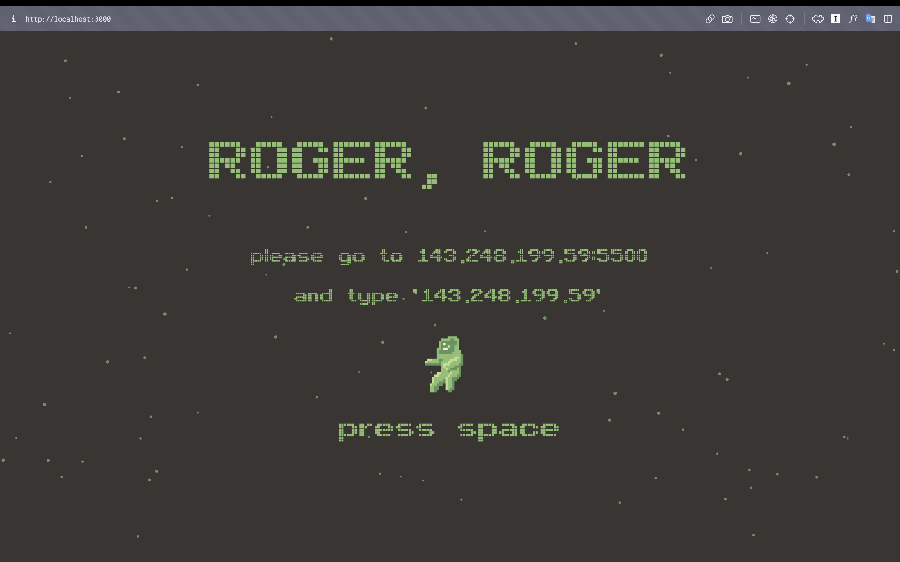

"Roger, Roger" is a cooperative game about a rocket travelling through space. Players have to navigate through asteroids by cooperative with each other. There is a total of 3 controls that can be accessed: trajectory control, acceleration control, and gun. trajectory control lets the player control the y-axis of the rocket, acceleration control lets the player control the x-axis, and gun lets player shoots.
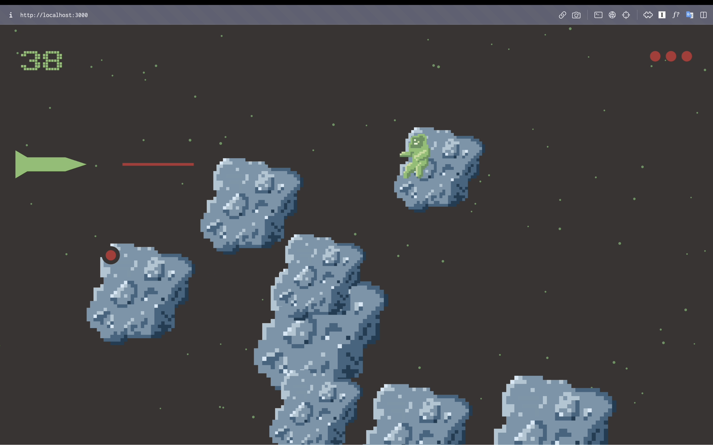

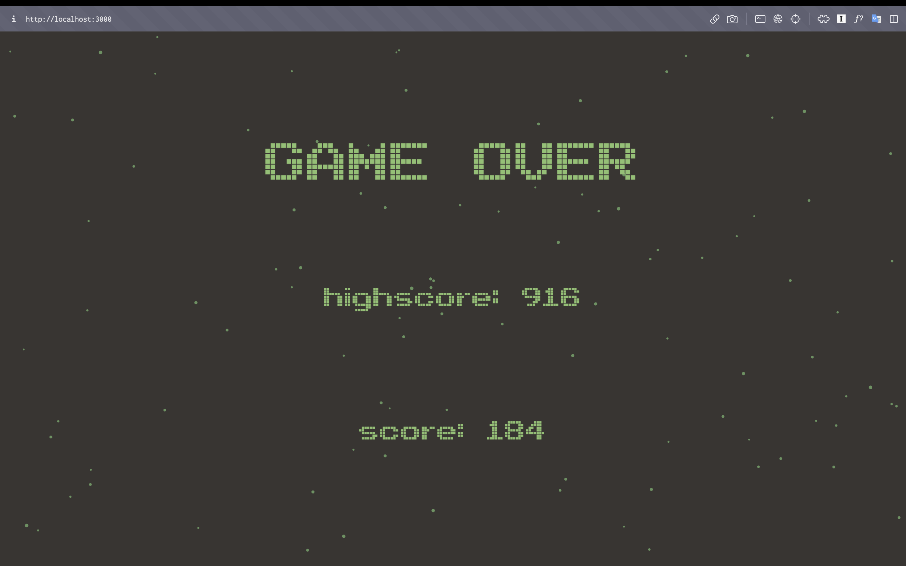

## The main screen

Upon the welcome screen, the player will be greeted with the title of the game, the IP address of the server, and the prompt "press space". The reason behind the IP address being displayed will be explained in [the control screen](#the-control-screen) section.


After all the players have connected and the captain pressed spacebar, the main screen shows the players the rocket they are controlling. It also shows the score and lives they have left. 

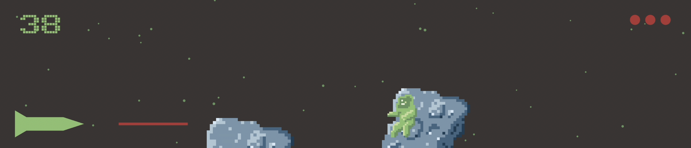

Group of asteroids are streaming through the right side of the screen at different velocity. The players have to use this visual display to based their control on. 

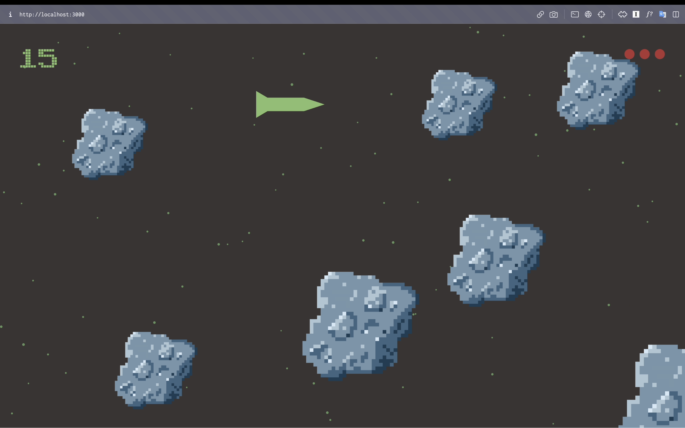

If the rocket ran out of life, the game ends. The last page will display the final score and whether you got the new highscore.


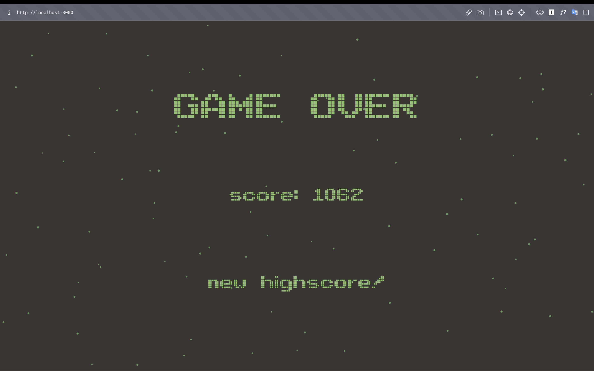

## The control screen
The control screen consisted of two parts: socket connection input and the control.

Socket connection input lets the player input the IP address of the server to gain control of the rocket. If the connection is successful, green circle appears on the right side of the input. This is because I want the server to be able to be hosted on the computer and in that case the IP address would be dynamically assigned. 

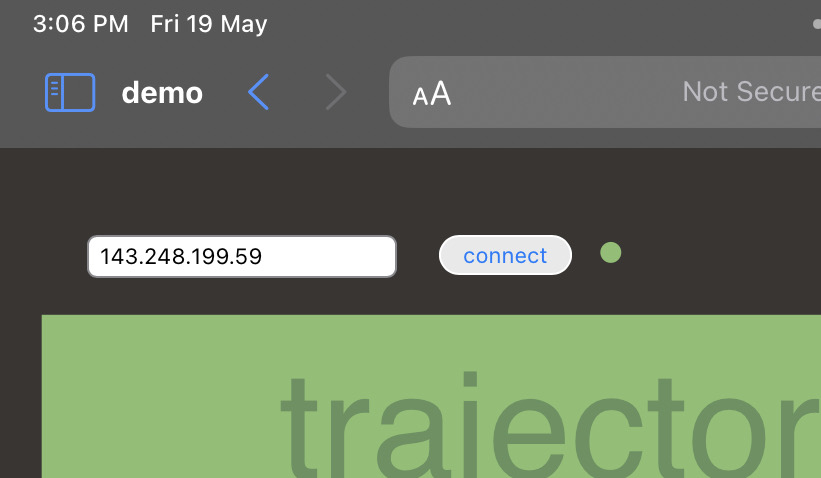

### Gun controls
lets the player controls the gun. There is a two seconds cooldown period for gun firing.

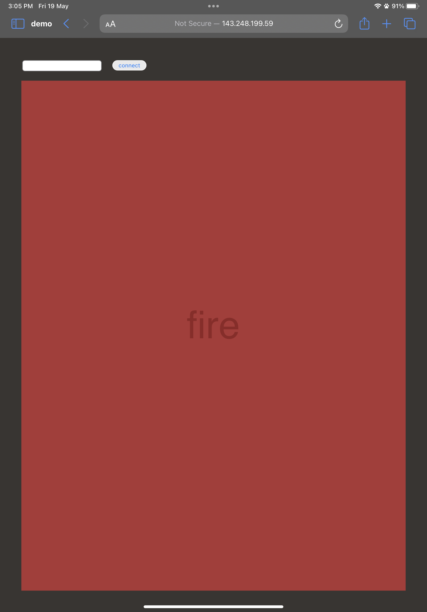

### Trajectory control
lets the player controls the up-down movement of the spaceship

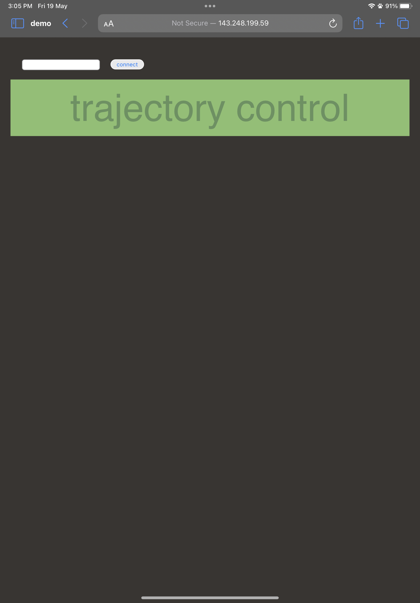

### Acceleration
lets the player controls the left-right of the spaceship

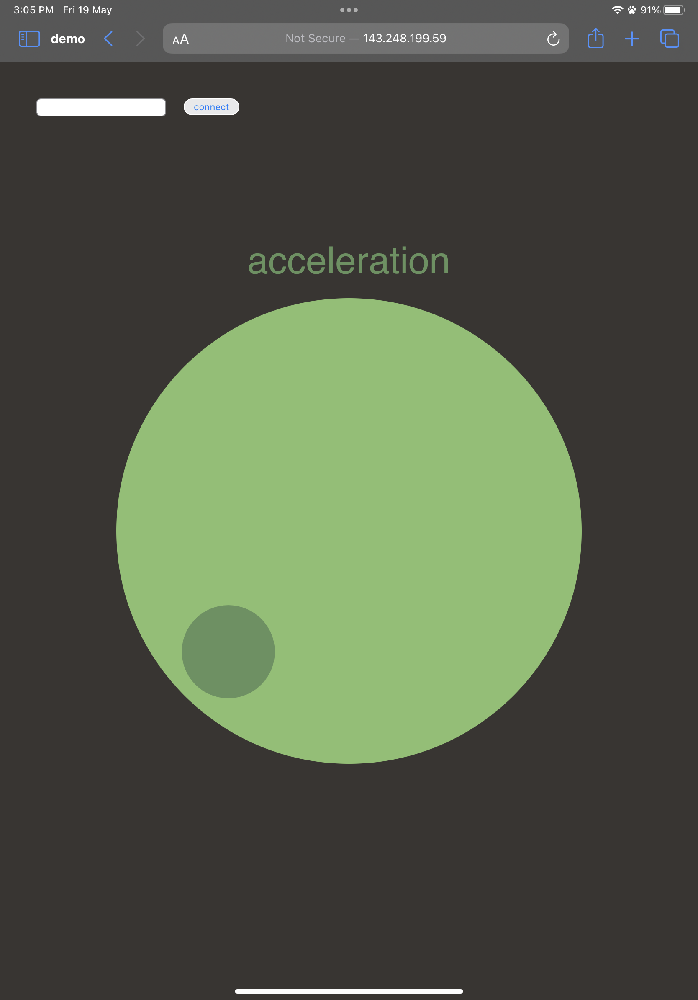

## The game mechanics
Player navigate through the group of asteroids. if they get hit, their lives decreases. they get points for shooting the asteroid depending on the size of it. There are astronauts that you can save. But you can hurt them if you accidentally shoot them. So, be careful around them. But the velocity increase with the score. The gun have a cooldown period of two seconds so players have to be conservative about their shooting. You can collect some lives as you go and save yourselves from dying. If you accidentally shoot the lives, they disappear.

To see a clearer picture, you can check my demo on [YouTube](https://youtu.be/GxBwiM4es7w)

## How to start?
After you clone the repository, you have to go into every folder ```
/client/display; gun-control; horizontal control; vertical control
``` and ```/server``` then run ```npm install``` for each one of them.

If you use Visual Studio Code and have a 'Go Live' extension, you can launch the control pages by go into `/client` then click go live.

For the display of the main screen, go into `/client/display` directory and run `npm run dev`

To initiate the server, go into`/server` then run `npx nodemon 'index.js'`

If there is an IP address appearing on your 'display' screen, you are ready to play!

## Highlight
After finishing all the code, I tried to draw some pixel art to elevate the gaming experience. So, I drew this astronaut and asteroid.

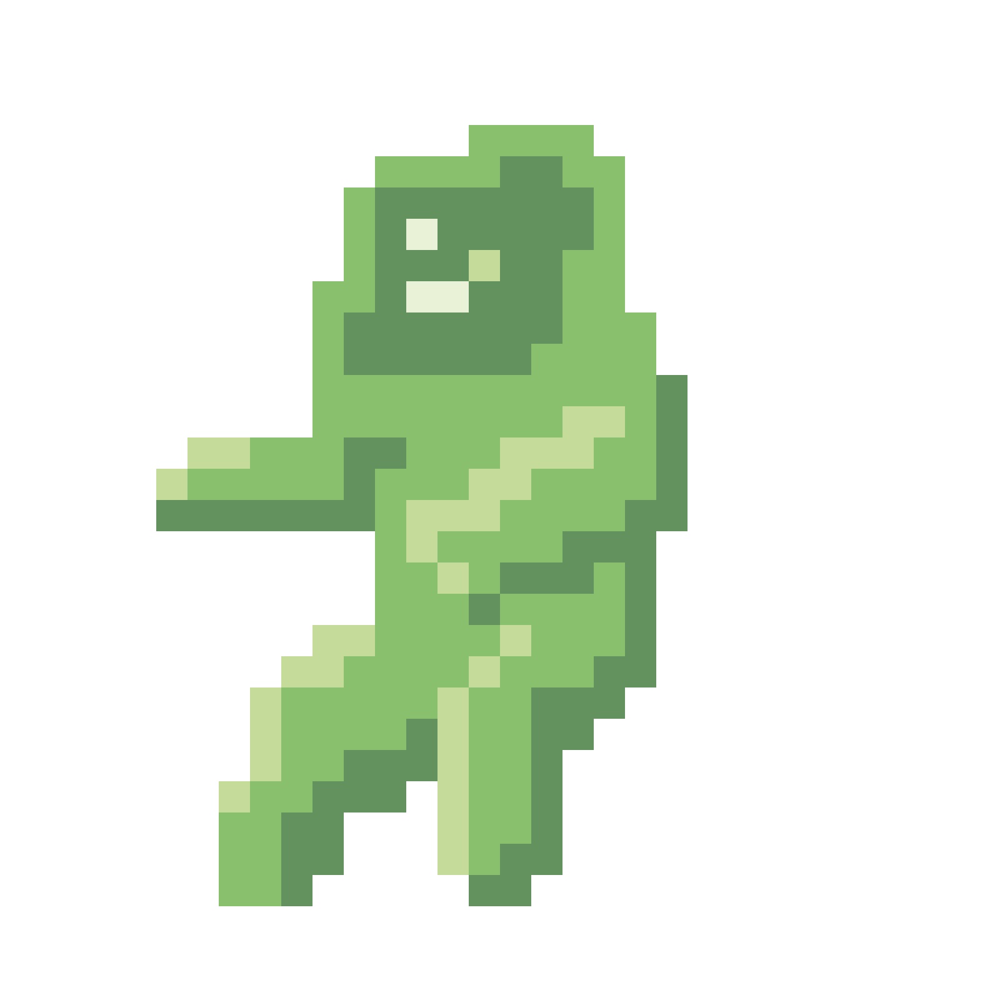 \
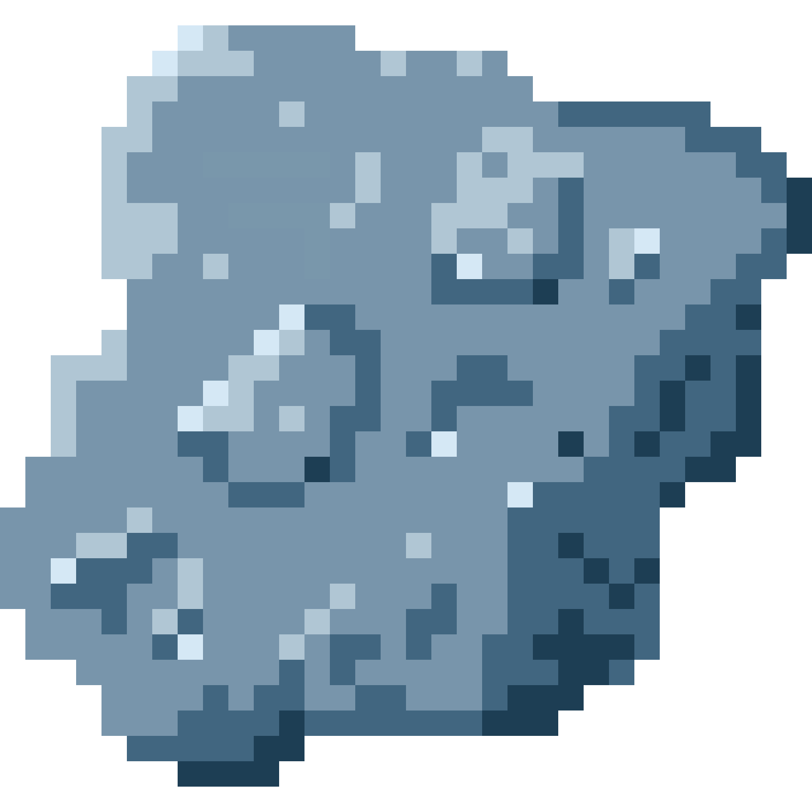

I also learned to postpone the socket.io connection and connect to the input IP (in the [control sections](#the-control-screen)) and I am really proud of it.

## Software
The game use node to host the server, P5JS to draw the graphics, and socket.io to allow the communication between devices.

## The architecture
This is the UML of the game code.

